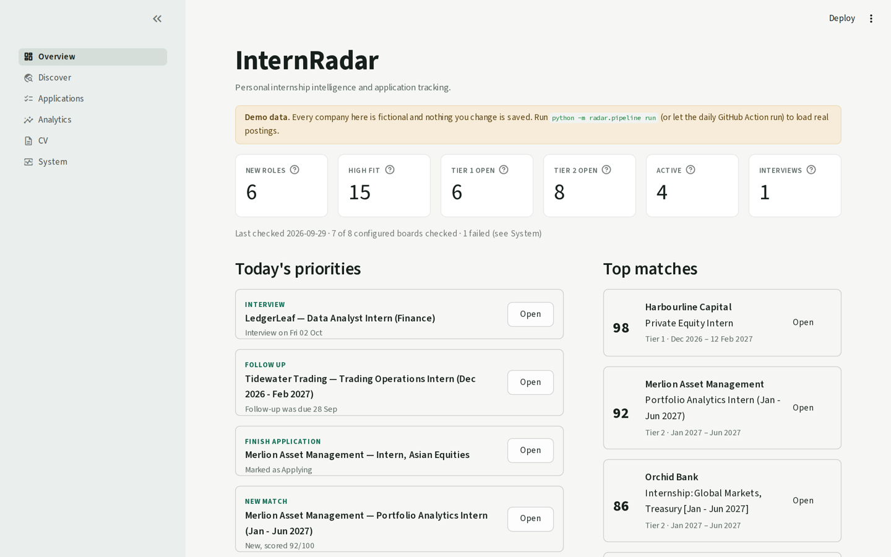
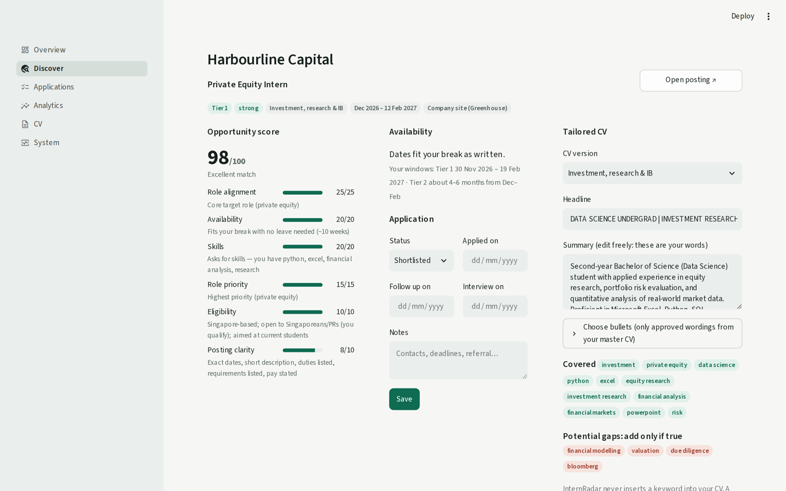
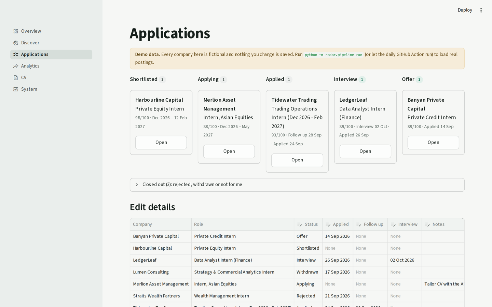
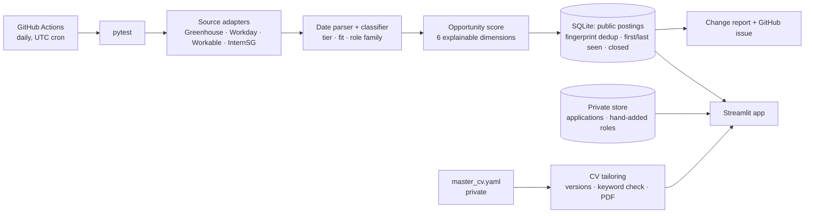

# InternRadar

**Personal internship intelligence and application tracking platform.**

InternRadar finds Singapore finance, investment and data internships every morning, works out which ones fit my availability, scores how worthwhile each one is, tracks my applications, and produces a tailored CV for each role from a single master CV.



## Why I built it

I was managing internship opportunities across several job boards, company career pages and application stages at once. The information lived in browser tabs, spreadsheets and my head. I wanted one system that would do four things:

- **Discover** new roles automatically.
- **Prioritise** them against my actual constraints: my university break, how long I can take leave for, and the kinds of roles I care most about.
- **Track** each application from shortlist to offer.
- **Tailor** a truthful CV for each role without rewriting it by hand every time.

It is a personal tool built around my own search rules, not a product for other users.

## What it does

### Pipeline
A daily job collects postings from company career boards (Greenhouse, Workday and Workable, the systems behind many firms' careers pages) and from InternSG, Singapore's main internship board. Each board is fetched independently:
- A failing board is logged and skipped, and never stops the run.
- A board's postings are marked *closed* only when that board was checked successfully.

### Deduplication
Each posting gets a fingerprint made from its normalised company and role title. Legal suffixes, dates, punctuation and word order are ignored. As a result:
- A repost under a new URL, or the same role on two sites, appears once.
- It doesn't trigger a second "new role" alert.
- The company's own listing is preferred over an aggregator's.

### Classification
- **Date parsing:** a rule-based parser reads internship timing out of free text, e.g. `[Dec26 to May27]`, `11 January 2027 – 30 June 2027`, `1H 2027`, `minimum of 12 weeks`, `4–6 months`, `available to start by mid December`.
  - Unknown dates stay unknown. "Applications close late December" is not read as a start date.
  - Dates inferred from a season name ("Winter 2026") are flagged as approximate.
- **Tiers:** each role goes into one of two tiers.
  - **Tier 1** fits my break (30 Nov 2026 – 19 Feb 2027) without leave.
  - **Tier 2** is a ~4–6 month role starting around then, which would need a leave of absence.
- **Fit:** each role also gets a fit label (*strong*, *stretch*, *weak* or *unclear*) with a one-line reason.
- **Role family:** a role family (investment, asset & wealth management, data, finance operations, strategy) picks the CV version.
  - Specific title phrases decide first, so *Investment Operations* is an operations role and *Portfolio Analytics* is asset management.
  - Otherwise, weighted evidence from the department and description decides.

### Opportunity score
A deterministic, explainable score out of 100 answers one question: *how worthwhile is this role for me to investigate or apply to?*

| Dimension | Max | What it measures |
|---|---|---|
| Role alignment | 25 | In-scope, analysis-oriented finance/investment/data work. Pure quant/software-heavy roles are marked down. |
| Availability | 20 | How well the dates fit. Tier 1 is ideal (no leave); Tier 2 within the preferred 4–6 months scores next. |
| Skills | 20 | Skills the posting asks for that my CV evidences, vs. ones it doesn't. |
| Role priority | 15 | My own priority groups (private equity and asset management first). |
| Eligibility | 10 | Location, and stated eligibility such as citizenship or student status. |
| Posting clarity | 10 | Whether dates, duties, requirements and pay are actually stated. |

Every point comes with a reason, shown in the app. **Unknown is not negative:** when a posting doesn't state dates, or has too little text to judge skills, that dimension gets neutral partial credit and is marked *unknown* rather than counted against the role.



### Application tracking
Each application moves through **Shortlisted → Applying → Applied → Interview → Offer**. Rejected, Withdrawn and Not for me are handled separately. Each record keeps:
- application date, last update, notes, follow-up date and interview date
- a short status history, so "reached interview" stays true even after a later rejection
- a small snapshot of the job, so analytics survive a posting closing

The Overview page turns these into **Today's priorities**:
- interviews coming up
- follow-ups that are due
- applications left in *Applying*
- new high-scoring roles
- strong roles not yet shortlisted

Nothing is flagged urgent unless a date I set makes it so.



### CV tailoring
`config/master_cv.yaml` is the only factual source. For each role family it defines a version:
- a headline and a focus sentence
- a goal sentence
- the order of experience bullets, choosing between wording variants I wrote
- the order of coursework and skills

Tailoring only **reorders and chooses**. It never adds experience, skills, certifications, achievements, numbers or keywords. The summary names the role, the company and my availability. In the app I can:
- edit the summary and headline
- pick which approved bullets to use
- download a one-page, text-based PDF that applicant tracking systems can read

**Keyword coverage** uses whole-word/phrase matching, so "valuation" never matches "evaluation". It puts each keyword the role asks for into one of three groups:

| Group | Meaning |
|---|---|
| Covered | The role asks for it and this CV shows it. |
| In your master CV, not in this version | Switch a bullet or version to show it. |
| Potential gap | Nothing in the master CV evidences it. **Add only if true.** |

**What the grounding tests actually guarantee** (`tests/test_cv.py`):
- Every bullet, skill, coursework item, certification and award in a tailored CV is copied verbatim from the master CV.
- The summary is assembled only from master-CV sentences, master skills, the role title and company, and my availability dates.
- Keywords from a posting that aren't in the master CV never appear in the output.

They do **not** prove the master CV itself is accurate, or that my wording variants are fair paraphrases of each other. I review those once, in the master file.

### Analytics
The Analytics page shows only honest numbers:
- applications, active, interviews, offers, rejections and withdrawals
- application → interview and interview → offer conversion, shown only once there are at least 3 cases, so a single result doesn't read as a percentage
- applications by role family, source and tier
- once there's enough data, whether higher-scored roles lead to more interviews

### Automation
A GitHub Actions workflow runs every morning:
1. Runs the tests; it never collects with broken code.
2. Runs the pipeline.
3. Commits the refreshed public job data.
4. Writes a run summary.
5. Opens an issue only when there are new Tier 1 or Tier 2 roles.

If no board at all can be checked, the run fails and GitHub emails me. Individual board failures are listed in the report and on the System page.

GitHub's cron runs in UTC with no daylight saving. `52 21 * * *` is 7:52am in Melbourne under AEST and 8:52am under AEDT.

## Architecture



| Path | Contents |
|---|---|
| `radar/sources/` | One adapter per board type. Parsers are pure functions, tested against recorded real responses in `tests/fixtures/`. |
| `radar/periods.py` | Free-text date and duration parser |
| `radar/classify.py` | Relevance filter, tiers and fit, role family |
| `radar/score.py` | Opportunity score |
| `radar/identity.py`, `radar/store.py` | Fingerprints; SQLite schema, migration, change tracking |
| `radar/pipeline.py` | Daily run, board health check, reports |
| `radar/applications.py`, `radar/manual.py` | Private application store; hand-added roles |
| `radar/insights.py` | Today's priorities and analytics |
| `radar/cv.py` | CV versions, keyword coverage, PDF rendering |
| `radar/demo.py` | Fictional demo data for a fresh clone |
| `app.py` | Streamlit app: Overview, Discover, Applications, Analytics, CV, System |
| `config/` | `profile.yaml` (availability, priorities, skills), `sources.yaml` (boards), `master_cv.example.yaml` |

## Tech stack

- **Python 3.11**
- **SQLite** via `sqlite3` for the job database, with a versioned in-place migration
- **Streamlit** for the app, with pandas for tables
- **GitHub Actions** for the daily run and notifications
- **pytest** for tests, with pypdf to check PDF text extraction
- **Libraries:** requests, BeautifulSoup, PyYAML, python-dateutil, fpdf2

## Data sources

InternRadar is **configured to monitor 36 boards**:
- 18 on Greenhouse (e.g. DRW, Squarepoint, Jane Street, Point72, StepStone)
- 14 on Workday (e.g. OCBC, Keppel, MUFG, CapitaLand, Blackstone, PwC)
- 3 on Workable (QCP, Moomoo, Igloo)
- InternSG

On 29 Sep 2026, every configured board answered its list endpoint when checked from a browser. That confirms the configuration. It doesn't prove the Python adapters have completed a full live run: they're tested against recorded real responses, and the first full run happens in GitHub Actions. Each run records how many boards were **configured**, **checked successfully** and **failed**. The System page shows this, and `python -m radar.pipeline check` re-tests every board on demand.

LinkedIn and jorb.ai are **not** collected automatically: their terms don't allow it. Roles found there, or through referrals and career fairs, are added in the app. They go through the same classifier and scorer.

## Getting started

```bash
python -m venv .venv && source .venv/bin/activate      # Windows: .venv\Scripts\activate
pip install -r requirements.txt
pytest                                                  # 197 tests
streamlit run app.py                                    # opens on fictional demo data
```

A fresh clone has no job database yet, so the app opens on **fictional demo data**: invented companies and sample applications, clearly labelled, with nothing saved. To use it for real:

```bash
cp config/master_cv.example.yaml config/master_cv.yaml  # then put your own details in it (git-ignored)
python -m radar.pipeline run                            # collect today's postings into data/radar.db
python -m radar.pipeline check                          # optional: which configured boards respond right now
```

Once the GitHub Action is running, `git pull` brings in each day's data. If you also run the pipeline locally, discard local changes to `data/` before pulling.

### Deploying the app (optional)
1. Push the repo to GitHub. In *Settings → Actions → General*, set *Workflow permissions* to **Read and write**. Run the workflow once from the *Actions* tab.
2. On [share.streamlit.io](https://share.streamlit.io), create an app from `app.py`. Under *Secrets*, paste the contents of `.streamlit/secrets.example.toml`, filled in:
   - `MASTER_CV`: your CV YAML
   - `APP_PASSWORD`
   - optionally `GITHUB_TOKEN` and `GITHUB_REPO`, pointing at a **separate private repo** where application statuses and hand-added roles are saved

## Configuration

- `config/profile.yaml`:
  - availability windows (Tier 1 dates, preferred Tier 2 length)
  - excluded and target role terms
  - role priority groups
  - skills and the CV evidence for them
  - eligibility facts
- `config/sources.yaml`: boards to monitor.
  - A Greenhouse board needs its token.
  - A Workday site needs its tenant, host and site name from its careers URL, plus an optional search phrase for global sites.
- `config/master_cv.yaml`: your CV and its tailored versions.

## Testing

**197 tests** (`pytest`) cover:

| Area | What's tested |
|---|---|
| Date parser | Realistic phrasing, and cases that must stay unknown |
| Classification | Ambiguous titles, exclusions, tier and fit rules |
| Score | Every dimension, unknown handling, determinism, ordering |
| Storage | Deduplication, reposts, close detection, migration of an old-format database |
| Applications | Status history, legacy migration, the private store |
| Adapters | Each parser, against recorded real responses |
| Pipeline | End to end with fixtures, including a failing board |
| CV | Grounding, whole-phrase keyword matching, one-page and text-extractable PDFs for every version |
| Insights | Today's priorities and analytics |

The suite passes with the public example CV, so it runs in CI without any personal data.

## Privacy

This repository is designed to be public without exposing a personal job search.

- **Git-ignored:**
  - `config/master_cv.yaml` (the real CV, with contact details)
  - `data/private/` (application statuses, notes, hand-added roles)
  - `.streamlit/secrets.toml` and any `.env` file
- **Committed by the daily run:**
  - `data/radar.db`, `data/jobs.csv` and `data/changes/` contain only publicly listed postings and their scores.
  - Hand-added roles are merged in by the app at runtime and never written to the job database.
- **Hosting:** when hosted, personal data goes into Streamlit secrets and, optionally, a separate private repo.
- **Demo:** `config/master_cv.example.yaml` describes a fictional person, and the demo data uses fictional companies.

## Limitations

- Workday and Workable endpoints are the ones their public career pages use, not formally documented APIs. A site change can break an adapter. The run log, the health check and the fixture tests make that visible quickly.
- The date parser is rule-based. Unusual phrasing ends up as "Dates unclear" rather than being guessed, so some roles need a manual look.
- Scores reflect my own priorities, set in `config/profile.yaml`. The skills dimension only sees what a posting's text states.
- The first full live collection hasn't run yet (see *Data sources*).
- Different intakes of the same role at one company (e.g. Jan–May and Jun–Dec) share a fingerprint and appear once.
- Status history is simple (date and status). It isn't a CRM.

## AI-assisted development

InternRadar was developed with Claude as an AI coding and development assistant.
- **My role:** I defined the product requirements, internship-search rules, workflow, feature specifications and validation criteria, and reviewed the results.
- **Claude's role:** accelerating implementation, debugging, testing and iteration.

## Example resume entry

*An example to update once the project has real usage. Keep only claims you can verify, and add live metrics (roles tracked, applications made) from your own data.*

> **InternRadar — Personal Internship Intelligence Platform** | Python, SQL, Streamlit, GitHub Actions
> - Built a Python/SQLite pipeline, scheduled with GitHub Actions, that monitors company career boards and InternSG, deduplicates reposts and tracks new and closed roles
> - Wrote a rule-based date parser, role classifier and explainable 100-point opportunity score, covered by a 197-test pytest suite
> - Built a Streamlit app for application tracking and analytics, with tailored, ATS-readable CVs generated only from a single master CV

## License

MIT. See [LICENSE](LICENSE).
